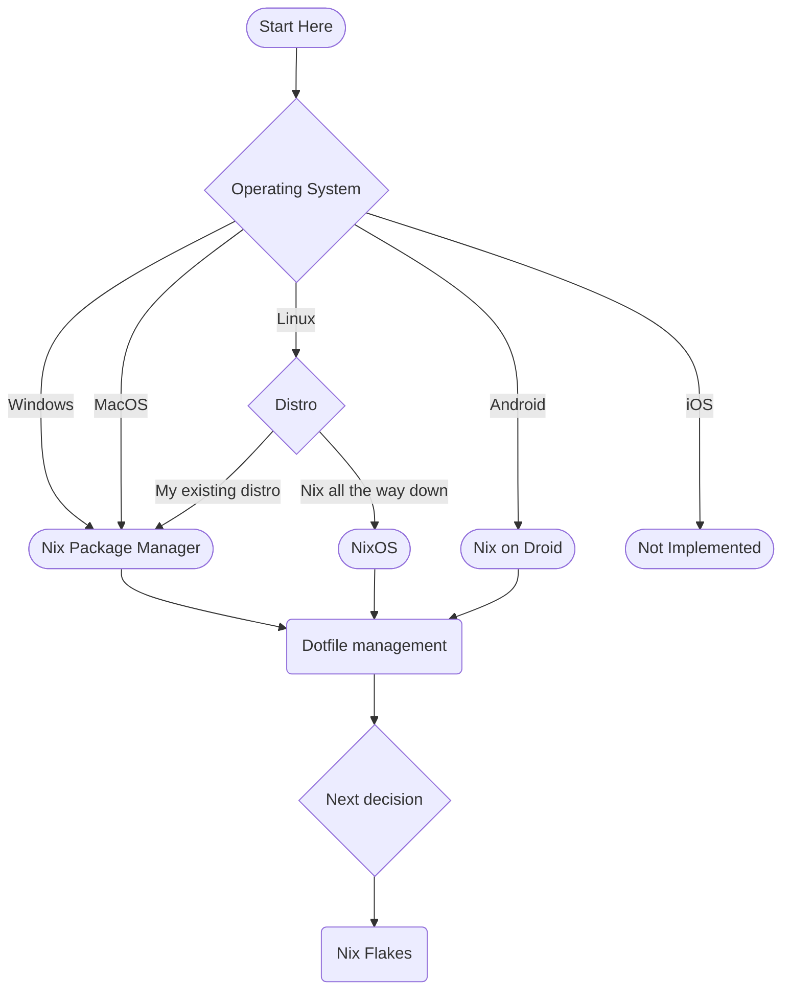
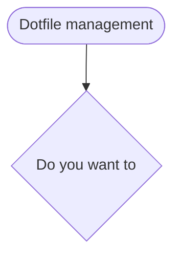

## NixOS vs Nix Package Manager

```mermaid
flowchart TD
  start([Start Here])
  which-os{Operating System}
  nix([Nix Package Manager])
  nix-on-droid([Nix on Droid])
  nixos([NixOS])
  not-implemented([Not Implemented])
  full-os{Distro}
  start --> which-os
  which-os -->|Windows| nix
  which-os -->|MacOS| nix
  which-os -->|Linux| full-os
  which-os -->|Android| nix-on-droid
  which-os --->|iOS| not-implemented
  full-os -->|My existing distro| nix
  full-os -->|Nix all the way down| nixos
  
  dotfiles(Dotfile management)
  nix --> dotfiles
  nixos --> dotfiles
  nix-on-droid --> dotfiles
  
  dotfiles --> simple{Next decision}
  
  flakes(Nix Flakes)
  
  simple --> flakes
```

- [[NixOS]]
- [[Nix Package Manager]]
- [[Nix on Droid]]

## Home Manager vs gnustow

```mermaid
flowchart TD
  dotfiles([Dotfile management])
  used-at-all{Do you want to}
  
  dotfiles --> used-at-all
```

## Flakes

```mermaid
flowchart TD
  flakes([Nix Flakes])
```
